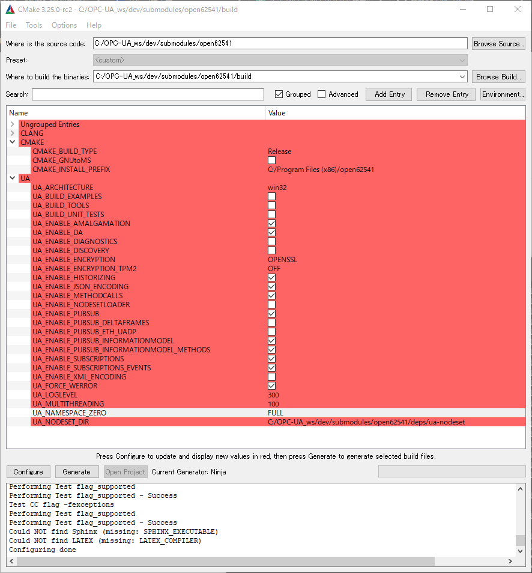

# About this memo
- Using in Windows 10

# clone
```
$ git clone https://github.com/falfang/OPC-UA_ws dev --recursive
```

# Install
## Install ninja
```
$ git clone https://github.com/ninja-build/ninja.git -b release
$ cd ninja
$ cmake -S . -B build -G "MinGW Makefiles"
$ cmake --build build
$ cmake --install build --prefix .
```
binフォルダ内に"ninja.exe"が生成されるので、これを環境変数に登録する

## Build open62541
submodulesファイル内のopen62541に移動して、以下のコマンドを実行する

```
$ cmake-gui .
```

その後、configureからNinjaプロファイルを指定する.
（Web上からexeを引っ張ってくる方法だと正常に動作しないことを確認。gitからソースを取得し、自分でビルドしたら正常に出来た。）

以下のような設定を行った。
```
$ cmake -S . -B build -G "Ninja" -DUA_BUILD_EXAMPLES=ON -DUA_ENABLE_PUBSUB=ON -DUA_ENABLE_SUBSCRIPTIONS=ON -DUA_ENABLE_ENCRYPTION=OPENSSL -DUA_ENABLE_PUBSUB_INFORMATIONMODEL=ON -DUA_ENABLE_PUBSUB_INFORMATIONMODEL_METHODS=ON -DBUILD_SHARED_LIBS=ON
```



- BUILD_TOOLSは要らなかったかも…

ビルドとインストールを行う。インストール先はdevフォルダ。
```
$ cd dev/submodules/open62541
$ cmake --build build
$ cmake --install build --prefix ../..
```

